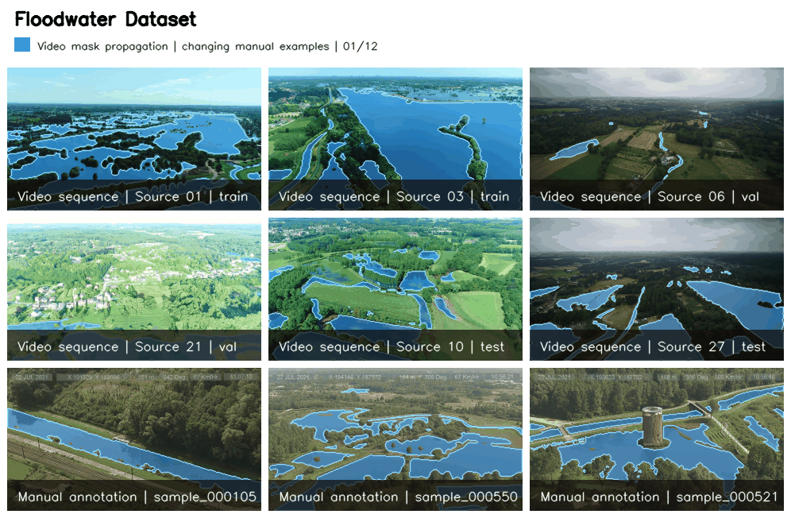

# Floodwater Dataset

A dataset of oblique UAV video from flood-affected areas in Belgium with binary, frame-level water pseudo-labels and a separately packaged manual evaluation set. It accompanies the IEEE JSTARS article [*Efficient On-Board Processing of Oblique UAV Video for Rapid Flood Extent Mapping*](https://doi.org/10.1109/JSTARS.2026.3729310).

The code and dataset are released under the [GNU General Public License v3.0](LICENSE). The video corpus contains SAM2-assisted pseudo-labels; the manual evaluation set contains directly annotated masks.

## Dataset overview



| | Train | Validation | Test | Total |
|---|---:|---:|---:|---:|
| Source videos | 22 | 4 | 5 | 31 |
| Video chunks | 68 | 13 | 17 | 98 |
| Labeled frames | 159,848 | 30,017 | 41,159 | 231,024 |
| Manual image/mask pairs | — | — | — | 700 |
| Water-pixel fraction | 19.32% | 11.31% | 19.17% | 18.29% |

- Binary semantic segmentation: `0 = background/non-water`, `255 = water`.
- 93 chunks at 1280×720 and five chunks at 1920×1080, all at 25 fps.
- 9,541 seconds of video, approximately 2 h 39 min.
- Splits are source-video-disjoint: all chunks from a source remain in one split.

The separate manual evaluation set contains 700 manually annotated image/mask pairs: 466 at 1280×720 and 234 at 1920×1080.

## Download and visualize

### Video dataset download

The dataset payload is distributed as one `floodwater-dataset-v1.0.0.zip` archive containing videos, masks, manifests, and split definitions. Documentation and utilities are maintained in this repository.

[Download the Floodwater Dataset](https://cloud.ilabt.imec.be/public.php/dav/files/YqqrGKwZPwwBSqK/?accept=zip)

```bash
SHARE_TOKEN="YqqrGKwZPwwBSqK"
DATASET_URL="https://cloud.ilabt.imec.be/public.php/dav/files/${SHARE_TOKEN}/?accept=zip"
curl -fL --user "${SHARE_TOKEN}:" "$DATASET_URL" -o floodwater-dataset-v1.0.0.zip
mkdir -p data
unzip -q floodwater-dataset-v1.0.0.zip -d data
mv data/floodwater-dataset-v1.0.0 data/floodwater_dataset
```

### Manual evaluation dataset

The 700 manually annotated image/mask pairs are distributed separately as `floodwater-manual-v1.0.0.zip`.

[Download the manual evaluation dataset](https://cloud.ilabt.imec.be/public.php/dav/files/8ZsKAa7yRtznRjY/?accept=zip)

```bash
MANUAL_SHARE_TOKEN="8ZsKAa7yRtznRjY"
MANUAL_DATASET_URL="https://cloud.ilabt.imec.be/public.php/dav/files/${MANUAL_SHARE_TOKEN}/?accept=zip"
curl -fL --user "${MANUAL_SHARE_TOKEN}:" "$MANUAL_DATASET_URL" -o floodwater-manual-v1.0.0.zip
mkdir -p data
unzip -q floodwater-manual-v1.0.0.zip -d data
```

The extracted datasets are stored inside the repository-local `data/` directory:

```text
floodwater-dataset/
├── data/
│   ├── floodwater_dataset/      # extracted videos, masks, and manifests
│   └── floodwater_manual/       # extracted manual image/mask pairs
├── tools/
└── visualisations/
```

Alternative locations are supported through `FLOODWATER_DATA` for the video corpus, `FLOODWATER_MANUAL_DATA` for the manual set, or each command’s `--data-root` option.

### Install

```bash
cd floodwater-dataset
pip install -r requirements.txt
```

### Visualize

Video corpus:

```bash
python -m tools.visualize_dataset
python -m tools.visualize_dataset --split val
python -m tools.visualize_dataset --split val --chunk-id video_00008_chunk_001
python -m tools.visualize_dataset --split val --chunk-id video_00008_chunk_001 --frame 100
```

Controls: `Space` pauses, `N`/`P` changes chunk, `A` steps backward, and `Q` quits.

Manual evaluation set:

```bash
python -m tools.visualize_manual_dataset
python -m tools.visualize_manual_dataset --sample-id sample_000001
```

Controls: `N` or any unassigned key advances, `P` goes back, and `Q` quits.

### Validate

```bash
python -m tools.validate_dataset
python -m tools.validate_dataset --check-assets
python -m tools.validate_manual_dataset
```

The first command checks manifests, counts, and split isolation. The second also confirms every released video and mask path. The third validates all manual image/mask pairs, formats, dimensions, IDs, and binary mask values.

## Repository layout

```text
floodwater-dataset/
├── README.md
├── DATASET_CARD.md
├── LICENSE
├── data/
│   ├── floodwater_dataset/      # downloaded separately; ignored by Git
│   └── floodwater_manual/       # downloaded separately; ignored by Git
├── tools/
│   ├── __init__.py
│   ├── config.py
│   ├── dataset_utils.py
│   ├── manual_dataset_utils.py
│   ├── validate_dataset.py
│   ├── validate_manual_dataset.py
│   ├── visualize_dataset.py
│   └── visualize_manual_dataset.py
└── visualisations/
    ├── README.md
    ├── create_showcase.py
    ├── floodwater_showcase.gif
    └── floodwater_showcase.jpg
```

The large media files are hosted separately and are not committed to GitHub.

## Dataset layout

```text
data/floodwater_dataset/
├── data/
│   ├── videos/<chunk_id>.mp4
│   └── masks/<chunk_id>/<frame_index>.png
├── metadata/
│   ├── chunks.csv
│   └── samples.csv
├── splits/
│   ├── train_videos.txt, val_videos.txt, test_videos.txt
│   └── train_chunks.txt, val_chunks.txt, test_chunks.txt
└── metadata.json

data/floodwater_manual/
├── images/sample_<sample_id>.jpg
└── masks/sample_<sample_id>.png
```

The manual image and mask directories contain 700 pairs with matching sample identifiers.

## Filename naming scheme

Video chunks and their mask directories share the same descriptive, zero-padded identifier:

```text
video_{source_video_id:05d}_chunk_{chunk_index:03d}
```

Example:

```text
data/videos/video_00008_chunk_001.mp4
data/masks/video_00008_chunk_001/00084.png
```

| Token | Example | Meaning |
|---|---|---|
| `source_video_id` | `00008` | Stable source-video index |
| `chunk_index` | `001` | Chunk number within that source video |
| mask filename | `00084.png` | Zero-based frame index within the chunk |

Resolution, duration, frame count, split, and label provenance are recorded in `metadata/chunks.csv` and `metadata/samples.csv`.

Manual pairs use matching identifiers such as `images/sample_000001.jpg` and `masks/sample_000001.png`.

## Metadata format

`metadata/chunks.csv` contains one row per video chunk, including the source-video identity, original filename, split, video and mask paths, frame and mask counts, and video digest.

`metadata/samples.csv` contains one row per released labeled frame, including its stable sample ID, chunk, source video, split, zero-based frame index, chunk-relative time, video path, mask path, and label type. Column-name-based access is recommended because column order is not part of the interface.

## Python use

```python
from tools.dataset_utils import decode, iter_samples

sample = next(iter_samples(split="train"))
frame_bgr, mask = decode(sample)
water = mask == 255
```

Manual evaluation samples:

```python
from tools.manual_dataset_utils import decode_manual, iter_manual_samples

sample = next(iter_manual_samples())
image_bgr, mask = decode_manual(sample)
water = mask == 255
```

## Citation

Publications using the Floodwater Dataset should cite the following work:

```bibtex
@ARTICLE{11673226,
  author={Sharma, Vishisht and Leroux, Sam and Landuyt, Lisa and Witvrouwen, Nick and Simoens, Pieter},
  journal={IEEE Journal of Selected Topics in Applied Earth Observations and Remote Sensing},
  title={Efficient On-Board Processing of Oblique UAV Video for Rapid Flood Extent Mapping},
  year={2026},
  pages={1-17},
  doi={10.1109/JSTARS.2026.3729310},
  ISSN={2151-1535}
}
```
